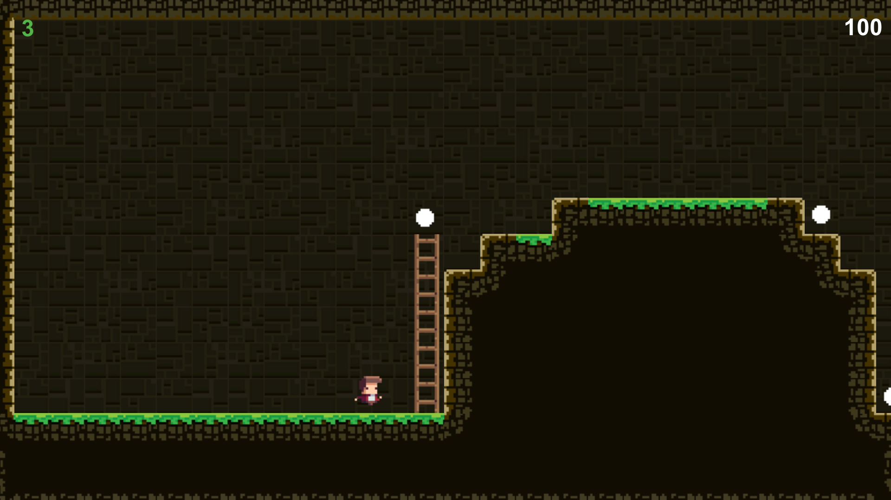

# TileVania

TileVania is a 2D platformer game developed in Unity using C# and object-oriented programming principles. The game was created as part of a Udemy course project.

## Features
- **Levels**: The game includes two exciting levels to play through.
- **Gameplay**: A classic platformer experience with obstacles, ladders, and collectibles.
- **Winning Screen**: A congratulatory screen when you complete the game.
- **Codebase**: Implemented using C# with a focus on object-oriented principles.

## How to Play
1. Download the repository and extract its contents.
2. Locate the `TileVania.exe` file within the project directory.
3. Double-click the `TileVania.exe` file to run the game.
4. Use the keyboard to control your character and navigate through the levels.
5. Complete the levels by reaching the exit while avoiding obstacles and collecting items.
6. Enjoy the game!

## Screenshots

### Start Screen

### Gameplay 1

### Gameplay 2

### Winning Screen

## Development
TileVania was built using:
- **Unity**: Game development engine.
- **C#**: Programming language for scripting.
- **Object-Oriented Principles**: Modular and reusable code structure.
